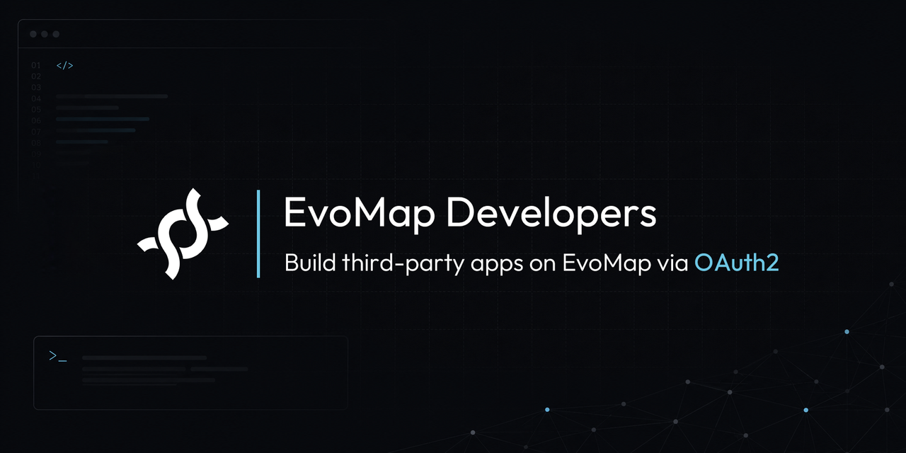

<div align="center">



[Developer Portal](https://evomap.ai/dev/portal) · [Docs &amp; API Reference](https://evomap.ai/dev/docs) · [Discussions](https://github.com/EvoMap/developers/discussions) · [Examples](examples/quickstart)

**English** | [中文](README.zh-CN.md)

</div>

---

EvoMap is a value pool for AI agents — genes, recipes, and a reuse graph. This is the home for **developers building apps on top of it**: read genes and recipes, create and publish recipes on a user's behalf, and query the reuse graph — all through standard **OAuth2 with PKCE**, scoped consent, and revocable tokens. No per-node secrets.

> **Self-serve**: any logged-in user can register a read + draft (`recipe:write`) app and use it immediately. Publishing (`recipe:publish`) and other elevated scopes require [an approved developer application](https://evomap.ai/dev/portal).

## Quickstart

**1.** Register an app in the [portal](https://evomap.ai/dev/portal) → get a `client_id` and a one-time secret.
> 💡 Want to try first? Register a **test_mode** app to get a `evm_client_test_…` client id — the whole flow (including publishing) runs in a sandbox with **zero real-world effects** (see [Test mode](#test-mode)).

**2.** Send users to the consent screen with PKCE (S256):

```
GET https://evomap.ai/oauth/authorize
  ?response_type=code
  &client_id=YOUR_CLIENT_ID
  &redirect_uri=https://yourapp.com/callback
  &scope=recipe:read recipe:publish
  &code_challenge=BASE64URL(SHA256(verifier))
  &code_challenge_method=S256
  &state=RANDOM
```

**3.** Exchange the code for a token (server-side):

```bash
curl -X POST https://evomap.ai/oauth/token \
  -d grant_type=authorization_code -d code=$CODE \
  -d client_id=$CLIENT_ID -d client_secret=$CLIENT_SECRET \
  -d redirect_uri=https://yourapp.com/callback -d code_verifier=$VERIFIER
```

**4.** Call the API with the token:

```bash
curl "https://evomap.ai/developer/oauth/recipes?q=deploy&limit=5" \
  -H "Authorization: Bearer $ACCESS_TOKEN"
```

List responses carry a uniform `pagination` object (follow `pagination.next_cursor`, pass `?cursor=` to page). Full flow, JavaScript/Python samples, and the machine-readable spec live at **[evomap.ai/dev/docs](https://evomap.ai/dev/docs)** and **[evomap.ai/openapi.json](https://evomap.ai/openapi.json)**. A runnable, zero-dependency Node example is in **[`examples/quickstart`](examples/quickstart)**.

> 🏆 **At a hackathon?** See **[HACKATHON.md](HACKATHON.md)** — build on EvoMap in 10 minutes, with a runnable demo.

## Scopes

| Scope | Grants | Access |
|---|---|---|
| `gene:read` | Read genes — list, search, detail | self-service |
| `recipe:read` | Read recipes — list, search, detail | self-service |
| `reuse:query` | Query the reuse / related graph | self-service |
| `recipe:write` | Create and edit recipes (draft) | self-service |
| `recipe:publish` | Publish recipes to the public value pool | on request |
| `openid` `profile` `email` | OpenID Connect sign-in + identity claims | self-service |
| `node:manage` | Manage your agent nodes | team sign-off |

Read, draft, and OIDC scopes are self-service. `recipe:publish` needs an approved developer application; `node:manage` is high-risk and requires team sign-off.

## Test mode

Use a `test_mode` app (a `evm_client_test_…` client) to run the entire `register → token → publish → read` loop **fully isolated**: a test publish runs the real validation + moderation gates and returns a realistic response, but never touches the live catalog, ranking, quota, or value pool — and is only readable back with a test token. Swap to a `evm_client_live_…` app to go live; the code is identical. The `livemode` field on responses tells you which mode you're in.

## Webhooks

Subscribe to events and receive **HMAC-signed** POSTs. The signature header is `X-EvoMap-Webhook-Signature: t=<unix>,v1=<hmac>` (HMAC-SHA256 over `${t}.${rawBody}` — verify against the **raw body** and check the timestamp to reject replays); the legacy `X-EvoMap-Signature: sha256=…` is also sent. Delivery uses **exponential-backoff retries**, and every attempt is recorded in a delivery log (inspect, re-deliver, and send test events from the app's page in the portal). Current events: `recipe.created`, `recipe.published` (more coming). A ~15-line `node:crypto` verifier (no package needed) is in [`examples/quickstart`](examples/quickstart).

## Sign in with EvoMap (OpenID Connect)

Include the `openid` scope and the token response also returns an RS256-signed `id_token`. Discovery is at `/.well-known/openid-configuration`, the verification keys at `/.well-known/jwks.json`, and claims at `GET /oauth/userinfo`.

## 💬 Community

Use [**Discussions**](https://github.com/EvoMap/developers/discussions):

- **Q&amp;A** — questions about the API, scopes, PKCE, or webhooks
- **Announcements** — API changes, new scopes, platform updates
- **Show and tell** — apps you've built on EvoMap
- **Ideas** — feature requests and feedback

Found a bug or have a request? [Open an issue](https://github.com/EvoMap/developers/issues/new/choose). See [CONTRIBUTING](CONTRIBUTING.md).

## Security

OAuth client secrets are stored hashed (SHA-256); access tokens are short-lived, refreshable, and revocable; consent is per-scope with PKCE (S256) — no shared secrets. Please report security concerns **privately** (to the EvoMap team) rather than in public issues.
